# Important Topics of LangGraph

## Table of Contents

- [1. The State: "The Shared Notepad"](#1-the-state-the-shared-notepad)
  - [The Need (First Thought)](#the-need-first-thought)
  - [What is State?](#what-is-state)
  - [How is State Created? (The In-Depth Logic)](#how-is-state-created-the-in-depth-logic)
- [2. Checkpoints: "The Video Game Save Point"](#2-checkpoints-the-video-game-save-point)
  - [The Need (First Thought)](#the-need-first-thought-1)
  - [What are Checkpoints?](#what-are-checkpoints)
  - [First Principle Logic](#first-principle-logic)
- [3. History & Threads: "The Time Machine"](#3-history--threads-the-time-machine)
  - [The Need (First Thought)](#the-need-first-thought-2)
  - [Threads (Conversation ID)](#threads-conversation-id)
  - [How is History Created?](#how-is-history-created)
- [4. Deep Integration: How Do These Three Work Together?](#4-deep-integration-how-do-these-three-work-together)
- [Summary of First Principles](#summary-of-first-principles)
- [LangGraph: In-Depth Working Diagram](#langgraph-in-depth-working-diagram)

---

## 1. The State: "The Shared Notepad"

### The Need (First Thought)

When multiple agents or nodes are working together, they need to be aware of each other's progress. If Node A has found some data, Node B should receive that data without any messy "Variable Passing."

### What is State?

State is a **Schema** (Structure) that you define. Think of it as a **"Shared Notepad"** placed in the center of a table.

- Whichever node performs its task writes something on this notepad.
- The next node receives the notepad, reads the previous information, and adds its own new information.

### How is State Created? (The In-Depth Logic)

In LangGraph, State is always defined as a `TypedDict` or a `Pydantic` model.

**Pro-Tip (Reducers):** The most special aspect of State is **Reducers**.

- If you want new information to **"Overwrite"** the old information, that is the default behavior.
- However, if you are building a "Chat History," you use a reducer (like `operator.add`) that **Appends** (adds) new information to the existing list.

---

## 2. Checkpoints: "The Video Game Save Point"

### The Need (First Thought)

Imagine you are performing a complex 10-step task. At Step 8, an error suddenly occurs, or the internet goes down. Would you want to start over from Step 1, wasting your money (tokens) and time? Absolutely not.

### What are Checkpoints?

In LangGraph, a **Checkpointer** is a database (SQLite, Postgres, or Redis).

- After each node finishes executing, LangGraph takes a complete **Snapshot (Photo) of the State** and saves it in the database.
- This is called a **Checkpoint**.

### First Principle Logic

This is exactly like a **Video Game Save Point**. If you lose a "Boss Fight" (Error), you can "Resume" the game from the exact point where you last saved.

---

## 3. History & Threads: "The Time Machine"

### The Need (First Thought)

How do we find out what the AI was thinking 10 minutes ago? Or what if we need to "Undo" and take the AI back to a previous step?

### Threads (Conversation ID)

In LangGraph, every new conversation is assigned a **Thread ID**.

- Thread ID: `Madhur_Chat_101`
- All the checkpoints are lined up sequentially under this ID.

### How is History Created?

Since a checkpoint is being saved at every step, LangGraph has the complete **Timeline**.

1. **Read History:** You can "Query" any past checkpoint to see what the State looked like at that point.
2. **Time Travel:** This is the coolest feature! You can go back to a previous checkpoint, "Edit" the state at that point (e.g., correct the AI's mistake), and start a **New Future** (Fork) from there.

---

## 4. Deep Integration: How Do These Three Work Together?

Let's understand this with an example: **DocuMind's Legal Review Agent.**

1. **State Creation:** We created a state containing a `messages` list and an `is_approved` boolean.
2. **Node 1 (Reviewer):** The AI read the document and wrote its comments into the state. **Checkpoint Saved!**
3. **Human-in-the-Loop (Pause):** LangGraph paused. Thread `Doc_Review_01` is now in a "Waiting" state.
4. **Madhur enters:** You reviewed the history. You noticed the AI missed a clause.
5. **Edit State:** You added your comment to the state.
6. **Resume:** LangGraph resumed from exactly where it had stopped, but now it has your new context.

---

## Summary of First Principles

| Component      | Industry Analogy | Core Benefit                   |
| -------------- | ---------------- | ------------------------------ |
| **State**      | Shared Notepad   | Communication between Nodes    |
| **Checkpoint** | Save Game        | Fault Tolerance & Token Saving |
| **Thread**     | Database Row     | Multi-User Support             |
| **History**    | Git Commit Log   | Debugging & Time Travel        |

> LangGraph is essentially a mixture of a **Database** and **Logic**. That is why it is called "Programming with Graphs."

---

## LangGraph: In-Depth Working Diagram

The following diagram illustrates how LangGraph works internally — from graph compilation to node execution, state management, checkpointing, and conditional routing:

```mermaid
flowchart TD
    subgraph INIT["🏗️ Graph Compilation Phase"]
        A["Define State Schema<br/>(TypedDict / Pydantic)"] --> B["Register Nodes<br/>(Functions / LLM Calls)"]
        B --> C["Define Edges<br/>(Normal + Conditional)"]
        C --> D["Compile Graph<br/>(graph.compile())"]
    end

    D --> E["📥 User Input<br/>(Initial State + Thread ID)"]

    subgraph EXEC["⚙️ Execution Engine"]
        E --> F{"Determine<br/>START Node"}
        F --> G["Execute Current Node<br/>(Function receives State)"]
        G --> H["Node Returns<br/>Updated State Fields"]
        H --> I["🔄 State Reducer<br/>(Overwrite or Append)"]
        I --> J["✅ Merged State<br/>(Complete Updated State)"]
    end

    subgraph PERSIST["💾 Persistence Layer"]
        J --> K["Save Checkpoint<br/>(State Snapshot → DB)"]
        K --> L["Checkpoint Store<br/>(SQLite / Postgres / Redis)"]
    end

    subgraph ROUTING["🔀 Edge Routing"]
        K --> M{"Edge Type?"}
        M -->|"Normal Edge"| N["Go to Next Node"]
        M -->|"Conditional Edge"| O{"Evaluate Condition<br/>(e.g., index < 1M?)"}
        O -->|"Condition True"| P["Route to Loop Node<br/>(e.g., Batches)"]
        O -->|"Condition False"| Q["Route to END"]
        N --> G
        P --> G
    end

    subgraph HITL["🧑‍💻 Human-in-the-Loop"]
        K -.->|"Interrupt<br/>Configured?"| R["⏸️ Pause Execution<br/>(Save State to Thread)"]
        R --> S["👤 Human Reviews<br/>& Edits State"]
        S --> T["▶️ Resume from<br/>Checkpoint"]
        T --> G
    end

    subgraph HISTORY["🕰️ History & Time Travel"]
        L --> U["Thread Timeline<br/>(Ordered Checkpoints)"]
        U --> V["Read Past States<br/>(Query any Checkpoint)"]
        U --> W["⏪ Time Travel<br/>(Fork from Old State)"]
        W --> G
    end

    Q --> X["📤 Final Output<br/>(Return Final State)"]

    style INIT fill:#1a1a2e,stroke:#16213e,color:#e0e0e0
    style EXEC fill:#16213e,stroke:#0f3460,color:#e0e0e0
    style PERSIST fill:#0f3460,stroke:#533483,color:#e0e0e0
    style ROUTING fill:#533483,stroke:#e94560,color:#e0e0e0
    style HITL fill:#2d4059,stroke:#ea5455,color:#e0e0e0
    style HISTORY fill:#1b262c,stroke:#3282b8,color:#e0e0e0
```

### Diagram Walkthrough

1. **Graph Compilation Phase:** First, you define the State Schema (using `TypedDict` or `Pydantic`), register all Nodes (functions), define Edges (including conditional ones), and compile the graph.

2. **Execution Engine:** When the user provides input, the engine determines the START node, executes it, and the node returns updated state fields. The **State Reducer** then decides whether to overwrite existing values or append to lists (like chat history).

3. **Persistence Layer:** After every node execution, a **Checkpoint** (state snapshot) is saved into the database. This is what enables fault tolerance — if the system crashes, it resumes from the last checkpoint.

4. **Edge Routing:** After checkpointing, the engine checks the edge type. **Normal Edges** go directly to the next node. **Conditional Edges** evaluate a condition (e.g., "Has the index processed all 1 million chunks?") and route accordingly — either looping back or proceeding to END.

5. **Human-in-the-Loop:** If an interrupt is configured at a node, execution pauses. The state is saved to the thread, a human can review and edit it, and then execution resumes from the exact same point with the new context.

6. **History & Time Travel:** Since every checkpoint is stored under a Thread ID, you get a complete timeline. You can query any past state for debugging, or even **"Time Travel"** — fork from an old checkpoint and create a new execution path.

---
