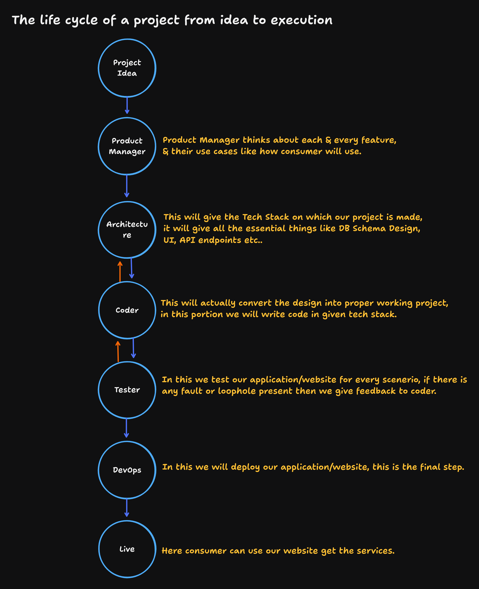
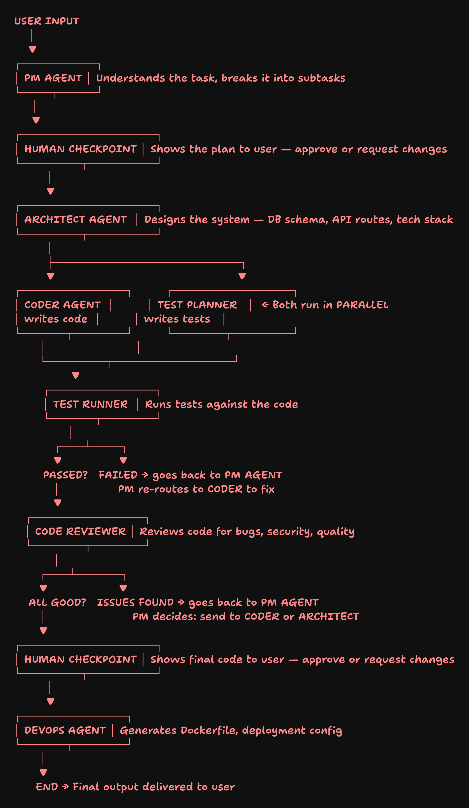

# 🧠 Problem Statement: Building a DevinAI-Like Multi-Agent Software Development Service

## 📌 Table of Contents

- [1. Introduction](#1-introduction)
- [2. Background: How Software Projects Work in the Real World](#2-background-how-software-projects-work-in-the-real-world)
- [3. The Core Problem](#3-the-core-problem)
- [4. What We Are Building](#4-what-we-are-building)
- [5. Detailed Agent Pipeline (What We Are Building)](#5-detailed-agent-pipeline-what-we-are-building)
  - [5.1 Phase 1 — PM Agent (Planning & Feature Design)](#51-phase-1--pm-agent-planning--feature-design)
  - [5.2 Phase 2 — Human Checkpoint (User Approval)](#52-phase-2--human-checkpoint-user-approval)
  - [5.3 Phase 3 — Architect Agent (System Design)](#53-phase-3--architect-agent-system-design)
  - [5.4 Phase 4 — Coder Agent + Test Planner (Parallel Execution)](#54-phase-4--coder-agent--test-planner-parallel-execution)
  - [5.5 Phase 5 — Test Runner (Automated Testing)](#55-phase-5--test-runner-automated-testing)
  - [5.6 Phase 6 — Code Reviewer (Quality Assurance)](#56-phase-6--code-reviewer-quality-assurance)
  - [5.7 Phase 7 — Final Human Checkpoint](#57-phase-7--final-human-checkpoint)
  - [5.8 Phase 8 — DevOps Agent (Deployment)](#58-phase-8--devops-agent-deployment)
- [6. Scope of This Implementation (Day 21 Focus)](#6-scope-of-this-implementation-day-21-focus)
- [7. Reference Diagrams](#7-reference-diagrams)

---

## 1. Introduction

In the modern software development world, AI-powered services like **DevinAI** are revolutionizing how projects are built — from a simple user idea all the way to a fully deployed, production-ready application. The goal of this project is to **build a similar multi-agent AI service** where the user provides nothing more than a **natural language prompt** describing what they want, and the system's AI agents collaboratively take that idea through the entire software development lifecycle — planning, architecture, coding, testing, review, and deployment.

---

## 2. Background: How Software Projects Work in the Real World

Before we dive into what we are building, it is essential to understand **how a real-world software project flows from idea to execution**. The diagram below (Problem-1) illustrates this lifecycle:

### The Real-World Project Lifecycle

| **Stage**              | **Role**           | **Responsibility**                                                                                                                                                                                                                      |
| ---------------------- | ------------------ | --------------------------------------------------------------------------------------------------------------------------------------------------------------------------------------------------------------------------------------- |
| **1. Project Idea**    | User / Stakeholder | The origin — someone has an idea for a product or feature.                                                                                                                                                                              |
| **2. Product Manager** | PM                 | Thinks deeply about **every feature**, its **use cases**, and **how the end consumer will use the product**. The PM does NOT deal with code or internal architecture — they focus purely on **what** to build, not **how** to build it. |
| **3. Architecture**    | System Architect   | Defines the **tech stack**, **database schema design**, **UI wireframes**, **API endpoints**, and all other essential technical decisions.                                                                                              |
| **4. Coder**           | Developer          | Converts the architectural design into a **working project** by writing actual code in the chosen tech stack. Has a **two-way feedback loop** with the Architect — if something is not feasible, they communicate back.                 |
| **5. Tester**          | QA Engineer        | Tests the application for **every possible scenario**. If any bugs, faults, or loopholes are found, they send **feedback back to the Coder** for fixes.                                                                                 |
| **6. DevOps**          | DevOps Engineer    | Handles **deployment** of the application — this is the final step before the product goes live.                                                                                                                                        |
| **7. Live**            | End User           | The application is now live and the **consumer can access and use the service**.                                                                                                                                                        |

> **Key Insight:** Notice how each stage has a distinct responsibility, and there are **feedback loops** between certain stages (Architect ↔ Coder, Tester → Coder). This is exactly how professional software teams operate.

---

## 3. The Core Problem

In a traditional setup, you need an **entire team of humans** — a Product Manager, an Architect, Developers, Testers, and DevOps engineers — to take a project from idea to deployment. This is:

- ⏳ **Time-consuming** — Coordinating across teams takes days, weeks, or even months.
- 💰 **Expensive** — Hiring and managing a full team is costly, especially for solo developers or startups.
- 🔄 **Error-prone** — Miscommunication between team members leads to bugs, feature gaps, and rework.
- 🚧 **Inaccessible** — A non-technical person with a great idea cannot easily get a working product built without hiring a team.

### ❓ The Question We Are Solving

> **"Can we replace this entire human team with a system of intelligent AI agents that collaborate autonomously to take a user's idea from a simple English prompt to a fully built, tested, and deployed application?"**

That is exactly what we are building — a **DevinAI-like multi-agent AI service**.

---

## 4. What We Are Building

We are building a **multi-agent AI system** that mirrors the real-world software development lifecycle. Each agent is an **LLM-powered autonomous unit** that performs a specific role, just like a human team member would. The user simply provides a **natural language prompt** (e.g., _"Build me a URL shortener with analytics dashboard"_), and the system handles everything else.

The complete agent pipeline is illustrated in the following diagram:

---

## 5. Detailed Agent Pipeline (What We Are Building)

The following is the **end-to-end flow** of our multi-agent system. Each phase maps directly to a real-world software development role:

---

### 5.1 Phase 1 — PM Agent (Planning & Feature Design)

| **Aspect**         | **Details**                                                                                                                                                            |
| ------------------ | ---------------------------------------------------------------------------------------------------------------------------------------------------------------------- |
| **Input**          | Raw user prompt (e.g., _"Build a todo app with authentication"_)                                                                                                       |
| **Role**           | Acts as the **Product Manager**                                                                                                                                        |
| **Responsibility** | Understands the user's idea, **breaks it down into subtasks**, identifies all possible **features**, defines **use cases**, and creates a structured **project plan**. |
| **Does NOT Do**    | Does NOT deal with any internal architecture, tech stack decisions, database design, or code — that is the job of later agents.                                        |
| **Output**         | A structured feature list, project plan, and prioritized task breakdown.                                                                                               |

> **This is the brain of the system** — it decides _what_ needs to be built, not _how_ to build it.

---

### 5.2 Phase 2 — Human Checkpoint (User Approval)

| **Aspect**         | **Details**                                                                                                                |
| ------------------ | -------------------------------------------------------------------------------------------------------------------------- |
| **Input**          | The PM Agent's plan (features, subtasks, project scope)                                                                    |
| **Role**           | Acts as a **review gate**                                                                                                  |
| **Responsibility** | Presents the proposed plan to the user. The user can **approve the plan** as-is, or **request changes** before proceeding. |
| **Output**         | An approved (or revised) plan that moves forward to the Architect Agent.                                                   |

> **Why is this important?** This ensures the user retains **full control** over what gets built. The AI proposes, but the human decides.

---

### 5.3 Phase 3 — Architect Agent (System Design)

| **Aspect**         | **Details**                                                                                                                                                                                                             |
| ------------------ | ----------------------------------------------------------------------------------------------------------------------------------------------------------------------------------------------------------------------- |
| **Input**          | The approved project plan from the Human Checkpoint                                                                                                                                                                     |
| **Role**           | Acts as the **System Architect**                                                                                                                                                                                        |
| **Responsibility** | Designs the entire technical system — selects the **tech stack**, creates the **database schema**, defines all **API routes/endpoints**, plans the **UI layout**, and structures the project's **folder architecture**. |
| **Output**         | A complete system design document ready for implementation.                                                                                                                                                             |

---

### 5.4 Phase 4 — Coder Agent + Test Planner (Parallel Execution)

This phase involves **two agents running simultaneously in parallel**:

| **Agent**        | **Role**   | **Responsibility**                                                                                                                                                     |
| ---------------- | ---------- | ---------------------------------------------------------------------------------------------------------------------------------------------------------------------- |
| **Coder Agent**  | Developer  | Takes the Architect's design and **writes the actual source code** — frontend, backend, database models, API logic — everything needed to make the project functional. |
| **Test Planner** | QA Planner | Simultaneously creates **test cases and test scripts** based on the Architect's design. These tests are written independently of the code to ensure unbiased testing.  |

> **Why parallel?** This mirrors real-world agile teams where developers and QA engineers work in parallel to save time.

---

### 5.5 Phase 5 — Test Runner (Automated Testing)

| **Aspect**         | **Details**                                                                                                                                                       |
| ------------------ | ----------------------------------------------------------------------------------------------------------------------------------------------------------------- |
| **Input**          | Code from the Coder Agent + Tests from the Test Planner                                                                                                           |
| **Role**           | Automated **Test Executor**                                                                                                                                       |
| **Responsibility** | Runs all the test cases **against the actual code**. Validates functionality, edge cases, and expected behavior.                                                  |
| **If Tests Pass**  | Proceeds to the Code Reviewer (Phase 6).                                                                                                                          |
| **If Tests Fail**  | Routes the failure report **back to the PM Agent**, which then re-routes to the **Coder Agent** to fix the issues. This creates a **self-healing feedback loop**. |

---

### 5.6 Phase 6 — Code Reviewer (Quality Assurance)

| **Aspect**          | **Details**                                                                                                                                                                                       |
| ------------------- | ------------------------------------------------------------------------------------------------------------------------------------------------------------------------------------------------- |
| **Input**           | The tested and passing codebase                                                                                                                                                                   |
| **Role**            | Senior **Code Reviewer**                                                                                                                                                                          |
| **Responsibility**  | Reviews the entire codebase for **bugs**, **security vulnerabilities**, **code quality**, **best practices**, and **performance issues**.                                                         |
| **If All Good**     | Proceeds to the Final Human Checkpoint (Phase 7).                                                                                                                                                 |
| **If Issues Found** | Routes the review feedback **back to the PM Agent**, which then decides whether to send it to the **Coder Agent** (for code fixes) or back to the **Architect Agent** (for design-level changes). |

---

### 5.7 Phase 7 — Final Human Checkpoint

| **Aspect**         | **Details**                                                                                                          |
| ------------------ | -------------------------------------------------------------------------------------------------------------------- |
| **Input**          | The reviewed, tested, and approved codebase                                                                          |
| **Role**           | **Final review gate**                                                                                                |
| **Responsibility** | Shows the final code and output to the user. The user can **approve for deployment** or **request further changes**. |
| **Output**         | An approved final build ready for deployment.                                                                        |

---

### 5.8 Phase 8 — DevOps Agent (Deployment)

| **Aspect**         | **Details**                                                                                                                                           |
| ------------------ | ----------------------------------------------------------------------------------------------------------------------------------------------------- |
| **Input**          | The user-approved final build                                                                                                                         |
| **Role**           | **DevOps Engineer**                                                                                                                                   |
| **Responsibility** | Generates the **Dockerfile**, **deployment configurations** (e.g., docker-compose, CI/CD pipeline configs), and handles the final deployment process. |
| **Output**         | **Final output delivered to the user** — a fully built, tested, reviewed, and deployed application.                                                   |

---

## 6. Scope of This Implementation (Day 21 Focus)

> ⚠️ **Important:** We are **NOT** building the entire pipeline in one go.

For this implementation (Day 21), our focus is specifically on the **PM Agent (Phase 1)** — the first and most critical component of the entire system:

| **In Scope**                                       | **Out of Scope (For Now)**    |
| -------------------------------------------------- | ----------------------------- |
| ✅ Accepting the user's natural language prompt    | ❌ Architect Agent            |
| ✅ PM Agent analyzing the prompt                   | ❌ Coder Agent                |
| ✅ Breaking down the idea into features & subtasks | ❌ Test Planner / Test Runner |
| ✅ Designing the project plan                      | ❌ Code Reviewer              |
| ✅ Presenting the plan for user approval           | ❌ DevOps Agent               |

### What the PM Agent Will Do

1. **Accept** a user's prompt describing their project idea.
2. **Analyze** the prompt to understand the core requirements.
3. **Identify** all possible features that the project could have.
4. **Break down** the project into structured, prioritized subtasks.
5. **Design** a comprehensive project plan with feature descriptions and use cases.
6. **Present** the plan to the user for review and approval.

### What the PM Agent Will NOT Do

- ❌ Select any tech stack or programming language.
- ❌ Design database schemas, API endpoints, or system architecture.
- ❌ Write any code or implementation logic.
- ❌ Handle testing, deployment, or any post-planning activities.

> The PM Agent is purely a **planning and feature design agent**. It decides **_what_** to build, not **_how_** to build it.

---

## 7. Reference Diagrams

### Diagram 1 — The Real-World Project Lifecycle (Idea → Execution)

This diagram shows how a software project traditionally flows through different roles — from the initial idea, through product management, architecture, coding, testing, DevOps, and finally going live.

---

### Diagram 2 — The AI Multi-Agent Pipeline (What We Are Building)

This diagram shows the detailed agent pipeline with all the AI agents, human checkpoints, parallel execution paths, and feedback loops that make up our DevinAI-like service.

---

> **In Summary:** We are building an AI-powered software development service where a user simply describes their idea in plain English, and a team of specialized AI agents collaboratively takes that idea through the complete software development lifecycle — from planning to deployment. For Day 21, we are focusing on building the **PM Agent**, which handles the critical first step: understanding the user's idea and designing a comprehensive project plan with features and subtasks.
