# Deep Learning by First Thought Principle

Hum as a human normal code like Prime Number, Fibonacci Series, Sliding Window, Tree traversal etc ka working code likha sakte hai, but ye hum tabhi likh sakte hai jab hume uske pichhe ka logic pata ho, & agar hume logic pata hai to hum usko kisi bhi language me likh sakte hai, & ab chunki humne khud ne code likha hai to hume iska multiple inputs per kya output aayega ye bhi confirm hota hai, jisse hum apne logic ko cross check kar sakte hai, & agar kahi koi galti hoti hai to hum usko easily fix kar sakte hai. Ab yaha jo output hai wo hume pahale se hi pata hota hai, isko hi hum **Deterministic Output** kahate hai.

- **Deterministic Output:** Iska simple matlab hota hai ki hume pahale se hi pata hota hai ki input per kya output aayega. Iska main concept hai ki hum jitni baar bhi same input denge wo her baar hume same output dega jaise agar humne 2+2 ka code likha to wo her baar 4 hi dega, chahe hum usko 100 baar bhi run kare.

## Why we need Deep Learning?

Abhi tak humne as a human wo problems to solve kar li thi jinka output deterministic hota hai, but real world me hume bahut si aisi problem face hui jinka output non-deterministic hota hai, & jinke according koi logic likhna impossible hota hai, jaise:-

**Problem1:** Hume ek image as a input leni hai, jisme koi bhi ek character likha hua hai, & hume us character ko as a output dena hai. Or isko hume sirf kisi specific language se hi build karna hai bina kisi third party library ke. Ye problem real life me exist karti hai, jaise CCTV camera se hamara challan kaise issue ho jata hai, toll per camera se Fastag ko wo kaise recognize kar leta hai. To in sabhi situation me CCTV ke liye vehicle ki number plate ek image hi to hai, & wo isme se data means number hi to extract karenge.

**Problem2:** Ya agar hume ek aisa system banana hai jisme hum image as an input lenge or output me hum us image me jo animal show ho raha hai uska naam de denge, to ye bhi to ek non-deterministic problem hi hai, kyuki isme hume pahale se nahi pata hota hai ki input me kya aayega, & iska output bhi non-deterministic hota hai.

> So in short deterministic input per hamesha deterministic output aayega, & non-deterministic input per non-deterministic output aayega.

---

## Solution of both problems

Ab hum ye sochenge ki hum as a human images ko ya things ko kaise recognize karte hai, menas agar hume kisi baby ko ye batana ho ki ye Dog hai ya ye Cat hai, to hum usko kaise batayenge?

Hum iske liye repeatation method ka use karte hai, matlab hum us baby ko baar baar Dog or Cat ko show karte hai, jisse uske mind me ek neural network build ho jata hai, & wo uske baad easily identify kar pata hai ki ye Dog hai ya Cat hai.

Ab agar hum soche to humne us baby ko koi hard & fast rule nahi bataya ki agar koi cheez gol hai or red hai to wo apple hogi & agar koi cheez gol hai to wo ball hogi, kyoki agar aisa hota to agar hum uske saamne Red Ball rakhte to wo usko Apple bol deta, jo ki galat hota.

To phir baby learn kaise karta hai, wo observation se learn karta hai, jo bhi cheez wo baar baar dekh raha hai, wo usko reality maanne lagta hai, jaise hum usko Dog ki image baar baar dikhakar usko ye batate hai ki ye Dog hai, to uske baad wo Dog or Wolf me easily difference kar pata hai, kyoki usne Dog ko baar baar dekha hota hai.

> But agar hum logically soche to hume nahi pata hota hai ki baby ke mind me kya chal raha hota hai, wo kaise learn karta hai, iska koi bhi logic nahi hai. Aise hi emotions ke regarding bhi koi logic nahi hota ki human ko anger kab feel hota hai, kab usko happy feel hota hai etc, bus hume ye pata hai ki koi harmon release hota hai isliye aisa hota hai. But uske pichhe ka logic nahi pata ki aakhir wo harmon bhi kab release hota hai. Jaise agar hume koi mazak me kuch galat bhi bol de to hum us time to laugh karte hai, but agar koi hume seriously kuch galat bol de to hum anger ho jate hai. Ab iska kya logic hai & anger me bhi kitna angry hue hai menas sirf kuch chilla chot kar rahe hai ya fight karne lag gaye hai.

Aise hi hume as a human ye bhi nahi pata ki hamari original language kya hai, means ek baby or dog dono ke saamne hum kuch bhi words bolte hai, to wo usko kaise identify karke adapt kar leta hai, & baby or dog dono hi hamari baat ko samjhate to hai, but baby bolna seekh jata hai per dog nahi bol pata. Or aise hi agar hum baby ko uski mothertoung to seekhate nahi hai, jaise hindi, english, urdu, russian, french etc hum uske samne sirf kuch words ya sentence hi baar baar repeat karte hai, & wo fir khud hi different type of sentences even words bhi bolne lag jata hai, jo kabhi humne usko seekhaye bhi nahi. Ye kaise possible hota hai, iska koi bhi logic nahi hai.

> Aise hi hume as a human ye bhi nahi pata ki hum sochate kaise hai, hum kisi bhi cheez ko learn kaise karte hai. Aise hi hum conciousness ko bhi define nahi kar sakte.

Agar humne in sabhi cheezon ko define kar diya, to wo logic ka use karke hi hum usko code me replicate nahi kar sakte kya, to hum abhi tak AGI ko build kar chuke hote.

---

## How we solve non-deterministic problems

So iske liye hum ek method use karte hai, hum bahut saare input or uske corresponding output dete hai, or hum ek function build karwate hai jiska use hum similar type ke data ke output find karne ke liye karte hai.

$$
\text{input} \xrightarrow{\text{function}(x)} \text{output}
$$

Hum deterministic problems ko solve karne ke liye hum khud function likhate hai, but non-deterministic problems ko solve karne ke liye hum function khud nahi likhate, balki hum usko machine se build karwate hai. Jiske liye hum usko bahut saare input or uske corresponding output dete hai.

> In short hum Deep Learning me us Function(X) ko hi find karte hai.

---

## Some Other Problems

**Problem1:** Agar hume Study hours diye ho or uske corresponding marks diye ho, to hum uske basis per prediction kar sakte hai agar hume study hours diye gaye ho to?

| Study (X) | Marks (Y) |
| --------- | --------- |
| 2         | 22        |
| 3         | 32        |
| 4         | 42        |
| 5         | 52        |
| 6         | 62        |
| 7         | ?         |

Ab agar hum yaha notice kare to hume ek formula dikh raha hai.

```formula
Y = 2*X + 2
```

So iska output 16 aayega.

**Problem2:** Agar hume Study Hours, Sleep Hours or Mraks diye hue ho to kya agar hume Study Hour, Sleep ki value milane per Marks ko predict kar sakte hai?

| Study(X) | Sleep(Y) | Marks(Z) |
| -------- | -------- | -------- |
| 3        | 2        | 25       |
| 4        | 5        | 39       |
| 5        | 8        | 53       |
| 8        | 2        | 50       |
| 6        | 6        | 52       |
| 7        | 3        | ?        |

Ab isme bhi hum pattern to find kar sakte hai but hume time lagega.

```formula
Z = 5*X + 3*Y + 4
```

So iska output 48 aayega.

> Bus hum Deep Learning me ye Formula means Function ko hi generate karwate hai, or wo automatically isko generate karta hai, isliye hi hum iske pahale bahut saare input or uske corresponding output dete hai.

---

## How actually the formula is generated?

So hum isko problem2 ke liye samjhate hai, ab hume inke bich ka koi pattern ya relationship nahi pata. But hume ye pata hai ki hume 2 known values di hai X & Y so iske according hum eik genralized formula create karenge.

```formula
Z = W1*X + W2*Y + B
```

Ab isme W1, W2 & B unknown hai, or hume inko hi find karna hai, kyoki X or Y ki value to hume input me di hai, or uske correspoding output bhi diya hai, to hum isme ek initially W1, W2 & B ki random value le lenge. Or hum isme hit & try se actual value find karte hai W1, W2 & B ki.

Ab suppose humne W1 = 15, W2 = 2 & B = 1 le liya so hamare formule me hum ab X = 3, Y = 2 put karenge.

```solution
Z = 15*3 + 2*2 + 1
Z = 50
```

But hume pata hai ki hamara actual output 25 hai, so hume jo output receive hua hai wo actual output ka 2times hai, to humare mind me thought aayega ki agar hum saare hi W1, W2 & B ko 2 se divide kar de to hume desired output mil jayega.

But hum aisa nahi karna chahiye, kyoki hume nahi pata ki aage kya hoga, kyoki hume to abhi sirf 1 input or uske corresponding output ke basis per hi ye idea aaya hai, but real world me data aisa to nahi hota hai na ki hamesha pattern exist kare hi, so hume actual pattern ke nearest pahuchana hai, & most of the time **Deep Learning** me hume accurate pattern nahi milta hai.

Ab humne W1, W2 or B kyo liya?

Aisa humne isliye kiya kyoki humne socha ki aisa to possible hi nahi hoga, ki input X or Y ko hum direct hi output Z me convert kar de, to hamara output hamesha kuch percentage X per, kuch percentage Y per or kuch percentage constant per depend karega, isliye humne W1, W2 & B ko liya. Or agar wo dependent nahi hota to W1, W2 & B ki value 0 ya 1 ho jati.

> Deep Learning me hum hamesha ye W1, W2 jaise weights or B jaise constant ki value hi find karte hai.

---

## Why we don't divide by 2?

Kyoki hamare real world data me noise present hoti hai, **Noise** means real world me kaafi huge amount data hota hai, so isme kaafi saare aisa data bhi present hota hai jo ki sahi nahi ho ho sakta hai usme kaafi saari values galat ho, ya usme kaafi saare outliers present ho, ya usme kaafi saare missing values present ho etc.



Isme hamare pass ek problem hai, ki agar hum aise divide karenge to ye instant jump karega or suppose ki agar bich me koi data wrong/noisy ho to uske according hamara whole function hi galat ho jayega, isliye hum isko divide ya instant jump nahi karte hai.

To iske solution ke form me hum isme bahut chhote chhote steps leta hu, so agar beech me koi wrong data present hai, to hum bahut hi kam movement karenge, or agar data sahi hai to hum uske according aage badhte jayenge.

Ab hum ye chhote chhote steps kaise decide karenge, to hum yaha per error find karte hai, jaise expected output or actual output ke bich ka difference find karte hai. Isko hi hum **Loss Function** kahte hai.

```
Loss Function/Error = Actual Output - Expected Output
```

---

## How we decide movement size/steps?

```
W1New = W1Old + (0.01 * Error)

W2New = W2Old + (0.01 * Error)

BNew = BOld + (0.01 * Error)
```

So we get the new value of W1 is 14.75, W2 is 1.75 or B is 0.75. So our new formula is:-

```formula
Z = 14.75*X + 1.75*Y + 0.75
```

Ab hum next value lenge X, Y ki, so we get:-

```
Z = 14.75 * 4 + 1.75 * 5 + 0.75
Z = 59 + 8.75 + 0.75
Z = 68.5
```

& our **Loss Function** is:-

```
Loss Function/Error = 39 - 68.5
Loss Function/Error = -29.5, So we take a roundOf -30.
```

So our new values of W1, W2 & B is:-

```
W1New = 14.75 + (0.01 * -30) => 14.45

W2New = 1.75 + (0.01 * -30) => 1.45

BNew = 0.75 + (0.01 * -30) => 0.45
```

Lekin agar hum dekhe to is tarah se to hum kabhi bhi actual output wale formule tak nahi pahuch payenge, kyoki hum hamesha 0.01 Error hi add/substract kar rahe hai, isliye hum isme ek **Learning Rate** bhi use karte hai, jo ki hume batata hai ki hume kitna step aage badhna hai.

Suppose ki agar X=0 & Y=5 to hume dikh raha hai ki W1 ka error/Loss Function me koi contributiion hai hi nahi, hum phir bhi isko punish kar rahe hai. Lekin previous method ke hisaab se hum W1New, W2New & BNew ko 0.01 Error se update kar rahe hai. Lekin actually Error aaya tha W2 & B ki wajah se to hume W1 ko update kyo karna hai, kyoki usne to error me koi contributiion hi nahi kiya hai. To iska solution kya hai?

So iske solution ke form me hum isme input se multiply karte hai Error me. Taaki jisne jitna contributiion kiya ho usko utna hi punishment mile. So new formula is:-

```
W1New = W1Old + (0.01 * Error * X)

W2New = W2Old + (0.01 * Error * Y)

BNew = BOld + (0.01 * Error * 1)
```

So ab agar X=3, Y=2, B=1 ho to Error = -25 hoga, so ab new W1, W2 & B ki value:-

```
W1New = 15 + (0.01 * -25 * 3) => 14.25

W2New = 2 + (0.01 * -25 * 2) => 1.5

BNew = 1 + (0.01 * -25 * 1) => 0.75
```

So ab ye teeno W1, W2 & B apni apni speed se move kar rahe hai. To ab hum isko next iteration me use karenge, or is tarah se hum hamesha apne actual output ke nearest pahuchte jayenge.

So agar humare pass 1000 data points hai, to ye zaroori nahi hai ki 100% accurate formula generate kar paaye, balki hum isme ye koshish karte hai ki hum jitna ho sake utna accurate formula ke pass pahuch jaaye. Kyoki real world me data me noise present hoti hai, isliye hum kabhi bhi 100% accurate formula nahi bana sakte.

So maybe 100 data points per train hone ke baad ye formula banega:-

```
Z = 4.98*X + 3.01*Y + 4.2
```

Is formula ko hi hum Single Neuron bolte hai. So basically hum **Deep Learning** me W1, W2 & B ki value ko hi find karte hai. Isme hum bahut se weights bhi le sakte hai jaise W1, W2, W3....etc.



## What is Epoch?

Epoch means ki humne apne model ko kitni baar train kiya hai, jaise agar humne apne model ko 100 baar train kiya to uske 100 epochs honge. Jaise hum as a human ek book ko ek certain number of time tak hi read karte hai jab tak hume kuch new things learn karne ko milti hai, waise hi hum apne model ko epochs tak train karte hai.

> So abhi tak hum sirf ek single line ki equation ko hi find karte hai, kyoki at the end hamara formula abhi ek straight line equation hi hai like y=mx+c. So humne abhi complex function ko find nahi kiya hai, jaise **Quadratic Function** or **Cubic Function** etc.

---
