# Activation Functions In Deep Learning

## Table of Contents

- [Recap: What Have We Learned So Far?](#recap-what-have-we-learned-so-far)
  - [Problem 1: Single Input, Straight Line](#problem-1-single-input-straight-line)
- [Why Do We Need More Than A Straight Line?](#why-do-we-need-more-than-a-straight-line)
  - [Problem 2: Overtime Payment (A Real-World Scenario)](#problem-2-overtime-payment-a-real-world-scenario)
- [Can We Solve This With Multiple Neurons?](#can-we-solve-this-with-multiple-neurons)
  - [Attempt 1: Chaining Neurons In Series](#attempt-1-chaining-neurons-in-series)
  - [Attempt 2: Running Neurons In Parallel](#attempt-2-running-neurons-in-parallel)
  - [The Historical Context (1960s–70s)](#the-historical-context-1960s70s)
- [What Is An Activation Function?](#what-is-an-activation-function)
- [What Is ReLU (Rectified Linear Unit)?](#what-is-relu-rectified-linear-unit)
  - [Dying ReLU Problem](#dying-relu-problem)
  - [Why Is ReLU So Popular In The Industry?](#why-is-relu-so-popular-in-the-industry)
- [Why Do We Always Use A Straight Line Equation?](#why-do-we-always-use-a-straight-line-equation)
- [How Does ReLU Help Solve Problem 2?](#how-does-relu-help-solve-problem-2)
- [Problem 3: Output With A Saturation Point (Two Bends)](#problem-3-output-with-a-saturation-point-two-bends)
- [Problem 4: Multiple Segments (Three Bends)](#problem-4-multiple-segments-three-bends)

---

## Recap: What Have We Learned So Far?

So far, we have studied only a single neuron, and how we find a straight-line equation which serves as our actual function/formula.

### Problem 1: Single Input, Straight Line

| Study Hour (X) | Marks (Y) |
| -------------- | --------- |
| 1              | 3         |
| 2              | 5         |
| 3              | 7         |
| 4              | 9         |
| 5              | 11        |
| 6              | 13        |
| 7              | ?         |

We find the answer using a straight line equation `y = mx + c`:

```equation
Y = 2*X + 1,   (Y = W1*X + B)
```

If we plot this on a graph, it forms a straight line. This is exactly why we say that a single neuron can only generate a straight line.


---

## Why Do We Need More Than A Straight Line?

We've seen so far that a single neuron can only build a straight line. But in real life, we don't always need just a straight line. Real-life equations can be quadratic, circular, elliptical, and so on — so how do we generate those?

Let's take a real-world scenario to understand this.

### Problem 2: Overtime Payment (A Real-World Scenario)

Suppose there is a person who works for a certain amount of time and receives no extra pay during that period. But as soon as they work beyond that time limit, they receive payment proportional to the extra hours worked per hour.

| Time (X) | Payment (Y) |
| -------- | ----------- |
| 1        | 0           |
| 2        | 0           |
| 3        | 0           |
| 4        | 1           |
| 5        | 2           |
| 6        | 3           |
| 7        | 4           |
| 8        | 5           |
| 9        | ?           |

If we look at the graph representation of this data, we can see **two straight lines** that form a single line by **bending** at a specific point. This bend is what we call the **Activation Function**.



Now we need to figure out how to build this bend — in other words, how to find the equation for it. If we were to write this in normal coding, it would look something like this:

```syntax
if(X<=3){
return 0;
}else {
return X-3;
}
```

The main question here is: **can we write this if-else logic in equation form in Deep Learning?** The answer is **Yes**. But if we already know the condition (i.e., we know the pattern), then we can write it in code ourselves. However, we use Deep Learning precisely when we **don't** know the pattern ourselves — meaning we can't write it manually. So the real question becomes: how do we create an equation for this?

---

## Can We Solve This With Multiple Neurons?

What if we use two neurons where the output of the first neuron becomes the input of the second neuron? Can we solve this problem?

### Attempt 1: Chaining Neurons In Series



From this, we learn that no matter how many neurons we chain together, at the end they will only generate a straight line.

### Attempt 2: Running Neurons In Parallel

And if we use multiple neurons in parallel, they still generate only a straight line.



So no matter how we connect multiple neurons — in series or in parallel — at the end, they will only generate a straight line.

### The Historical Context (1960s–70s)

This exact same problem was encountered in the 1960s–70s. And it was to solve this type of problem that the **Activation Function** was invented.

---

## What Is An Activation Function?

An **Activation Function** is a mathematical function that determines the output of a neuron. In simple terms, it says: if the output is ≤ 0, make it 0; otherwise, keep the output as it is.

```logic
if(output<=0){
    return 0;
}else {
    output;
}
```

This function provides us with exactly **one bend**. And it always applies on the output — meaning the input first passes through the neuron, and then the activation function is applied to the neuron's output.



This function is called the **ReLU Activation Function**.

---

## What Is ReLU (Rectified Linear Unit)?

ReLU stands for **Rectified Linear Unit**. Its mathematical formula is:

$$f(x) = \max(0, x)$$

What this means:

- If the input ($x$) is **Positive** (greater than 0), the output remains the same ($x$).
- If the input ($x$) is **Negative** (less than 0), the output is directly set to 0.

### Dying ReLU Problem

ReLU has an issue known as the **Dying ReLU Problem**:

- If a neuron keeps receiving negative inputs, its output will always be 0, and its gradient will also become 0.
- This means the neuron has effectively "died" and will never get updated during training.

To solve this problem, the following variants are used:

- **Leaky ReLU:** Instead of setting negative values to exactly 0, a very small value (like $0.01x$) is assigned.
- **ELU (Exponential Linear Unit):** Which makes the curve slightly smoother.

> ReLU gives neural networks **non-linearity** (so they can understand complex patterns) and is considered the fastest and most reliable choice.

### Why Is ReLU So Popular In The Industry?

1. **Sparsity:** Since negative values become 0, it means that at any given time, not all neurons in the network "fire." This makes the model **lightweight** and **efficient**.

   In short, because of this, only those neurons that actually contribute to the output will activate, and all the rest will remain deactivated. This makes the model lightweight and efficient.

2. **Computational Efficiency:** Functions like Sigmoid or Tanh require complex math (exponentials). ReLU only needs a simple if condition (`if x > 0 return x else 0`). This makes training significantly faster.

> **In short:** If we use many ReLUs together, we can even form a circle. This is because a single ReLU creates only a single bend.

---

## Why Do We Always Use A Straight Line Equation?

One very important question arises: why do we always find a straight-line equation? Who made the rule that our equation must always be `W1*X + B`? Why don't we use an equation like `W1*X + W2*X² + W3*X³ + W4*X⁴ + B` instead? Because if we need the formula `Y = X²`, we could simply consider `W2*X²` and set all others to 0.

The reason we use a straight-line equation is this: if we were to use `W1*X + W2*X² + W3*X³ + W4*X⁴ + ... + B`, we would have no way of knowing up to what power of X (`X^?`) we should include. This could theoretically go to infinity, and the computational resources required would be enormous because of all the calculations involved. There is also no fixed rule for how high a power we should use.

But if we keep a linear equation `Y = m*X + C`, then regardless of how many inputs we have, we can build the equation accordingly. For example, if we have three inputs: `Y = W1*X1 + W2*X2 + W3*X3 + B`. And similarly, for multiple inputs, we can easily create the equation: `Y = W1*X1 + W2*X2 + W3*X3 + W4*X4 + W5*X5 + ... + B`.

---

## How Does ReLU Help Solve Problem 2?

| Time (X) | Payment (Y) |
| -------- | ----------- |
| 1        | 0           |
| 2        | 0           |
| 3        | 0           |
| 4        | 1           |
| 5        | 2           |
| 6        | 3           |
| 7        | 4           |
| 8        | 5           |
| 9        | ?           |

Because of ReLU, our equation becomes:

```equation
Output = ReLU(X-3)

OR

Output = ReLU(max(0, X-3))
```

> **So a single neuron can create a single bend. If we need many bends, we need to use many neurons. This means: the more neurons, the more bends; the more bends, the more complex patterns we can learn.**

---

## Problem 3: Output With A Saturation Point (Two Bends)

In real life, it often happens that up to a particular point, no matter how much input we provide, the output remains 0. After that point, the output starts changing. And then there comes another point after which, no matter how much input we provide, the output stops changing. This means the output has hit its **saturation point**, after which we always get the same output.

| Time (X) | Payment (Y) |
| -------- | ----------- |
| 1        | 0           |
| 2        | 0           |
| 3        | 0           |
| 4        | 1           |
| 5        | 2           |
| 6        | 3           |
| 7        | 4           |
| 8        | 5           |
| 9        | 5           |
| 10       | 5           |
| 11       | 5           |
| 12       | 5           |



Now we can clearly see that there are **2 bends** here: the first bend is between 3 and 4, and the second bend is between 8 and 9. So we need to use **2 neurons** here, and apply the ReLU function on both neurons. At the end, we get an equation like this:

```equation
Output = ReLU(X-3) - ReLU(X-8)

OR

Output = ReLU(max(0, X-3)) - ReLU(max(0, X-8))
```

Let's cross-verify this with multiple X inputs:

| Time (X) | ReLU(X-3) | ReLU(X-8) | Total (Y = ReLU(X-3) - ReLU(X-8)) |
| -------- | --------- | --------- | --------------------------------- |
| 1        | 0         | 0         | 0                                 |
| 2        | 0         | 0         | 0                                 |
| 3        | 0         | 0         | 0                                 |
| 4        | 1         | 0         | 1                                 |
| 5        | 2         | 0         | 2                                 |
| 6        | 3         | 0         | 3                                 |
| 7        | 4         | 0         | 4                                 |
| 8        | 5         | 0         | 5                                 |
| 9        | 6         | 1         | 5                                 |
| 10       | 7         | 2         | 5                                 |
| 11       | 8         | 3         | 5                                 |
| 12       | 9         | 4         | 5                                 |

---

## Problem 4: Multiple Segments (Three Bends)

| Time (X) | Result (Y) |
| -------- | ---------- |
| 1        | 0          |
| 2        | 0          |
| 3        | 0          |
| 4        | 1          |
| 5        | 2          |
| 6        | 3          |
| 7        | 4          |
| 8        | 5          |
| 9        | 5          |
| 10       | 5          |
| 11       | 5          |
| 12       | 6          |
| 13       | 7          |
| 14       | 8          |
| 15       | 9          |
| 16       | 10         |

If we look carefully, this problem has **3 bends**: the first bend is between 3 and 4, the second bend is between 8 and 9, and the third bend is between 11 and 12. So we need to use **3 neurons** here, and apply the ReLU function on all three neurons. At the end, we get an equation like this:

```equation
Output = ReLU(X-3) - ReLU(X-8) + ReLU(X-11)

OR

Output = ReLU(max(0, X-3)) - ReLU(max(0, X-8)) + ReLU(max(0, X-11))
```

Let's cross-verify this:

| Time (X) | ReLU(X-3) | ReLU(X-8) | ReLU(X-11) | Total (Y = ReLU(X-3) - ReLU(X-8) + ReLU(X-11)) |
| -------- | --------- | --------- | ---------- | ---------------------------------------------- |
| 1        | 0         | 0         | 0          | 0                                              |
| 2        | 0         | 0         | 0          | 0                                              |
| 3        | 0         | 0         | 0          | 0                                              |
| 4        | 1         | 0         | 0          | 1                                              |
| 5        | 2         | 0         | 0          | 2                                              |
| 6        | 3         | 0         | 0          | 3                                              |
| 7        | 4         | 0         | 0          | 4                                              |
| 8        | 5         | 0         | 0          | 5                                              |
| 9        | 6         | 1         | 0          | 5                                              |
| 10       | 7         | 2         | 0          | 5                                              |
| 11       | 8         | 3         | 0          | 5                                              |
| 12       | 9         | 4         | 1          | 6                                              |
| 13       | 10        | 5         | 2          | 7                                              |
| 14       | 11        | 6         | 3          | 8                                              |
| 15       | 12        | 7         | 4          | 9                                              |
| 16       | 13        | 8         | 5          | 10                                             |

---
