# Advanced ReLU

## Table of Contents

- [Problem 1: Two-Segment Slope Change](#problem-1-two-segment-slope-change)
  - [Cross Verification](#cross-verification)
- [Problem 2: Flat Plateau After A Step Jump](#problem-2-flat-plateau-after-a-step-jump)
  - [Why Can We Choose Our Own Neuron Configuration?](#why-can-we-choose-our-own-neuron-configuration)
  - [Cross Verification](#cross-verification-1)
- [Problem 3: The Classic Y = X² Problem](#problem-3-the-classic-y--x-problem)
  - [Discovering The Pattern: Sum Of Odd Numbers](#discovering-the-pattern-sum-of-odd-numbers)
  - [Building The ReLU Equation](#building-the-relu-equation)
  - [Cross Verification](#cross-verification-2)
  - [Understanding Neuron Activation In This Context](#understanding-neuron-activation-in-this-context)
  - [The Two Patterns We Discovered As Humans](#the-two-patterns-we-discovered-as-humans)
  - [Why Deep Learning Outperforms Human Pattern Finding](#why-deep-learning-outperforms-human-pattern-finding)

---

## Problem 1: Two-Segment Slope Change

| X   | Y   |
| --- | --- |
| 0   | 0   |
| 1   | 0   |
| 2   | 0   |
| 3   | 0   |
| 4   | 0   |
| 5   | 0   |
| 6   | 0   |
| 7   | 0   |
| 8   | 0   |
| 9   | 0   |
| 10  | 0   |
| 11  | 1   |
| 12  | 2   |
| 13  | 3   |
| 14  | 4   |
| 15  | 5   |
| 16  | 6   |
| 17  | 7   |
| 18  | 8   |
| 19  | 9   |
| 20  | 10  |
| 21  | 11  |
| 22  | 12  |
| 23  | 13  |
| 24  | 14  |
| 25  | 15  |
| 26  | 16  |
| 27  | 17  |
| 28  | 18  |
| 29  | 19  |
| 30  | 20  |
| 31  | 22  |
| 32  | 24  |
| 33  | 26  |
| 34  | 28  |
| 35  | 30  |
| 36  | 32  |
| 37  | 34  |
| 38  | 36  |
| 39  | 38  |
| 40  | 40  |

Here is the graph-based visual implementation of this problem:



In this graph, we can see that there are **2 bends** — one at X=11 and the other at X=31. This means we need **2 neurons**, and for both neurons, we need **2 ReLU** functions. So our final equation becomes:

```eq
Output = ReLU(X - 10) + ReLU(X - 30)

OR

Output = ReLU(max(0, X - 10)) + ReLU(max(0, X - 30))
```

### Cross Verification

Let's cross-verify this equation:

| X   | ReLU(X - 10) | ReLU(X - 30) | Output (ReLU(X - 10) + ReLU(X - 30)) | Y   | Match? |
| --- | ------------ | ------------ | ------------------------------------ | --- | ------ |
| 0   | 0            | 0            | 0                                    | 0   | Yes    |
| 1   | 0            | 0            | 0                                    | 0   | Yes    |
| 2   | 0            | 0            | 0                                    | 0   | Yes    |
| 3   | 0            | 0            | 0                                    | 0   | Yes    |
| 4   | 0            | 0            | 0                                    | 0   | Yes    |
| 5   | 0            | 0            | 0                                    | 0   | Yes    |
| 6   | 0            | 0            | 0                                    | 0   | Yes    |
| 7   | 0            | 0            | 0                                    | 0   | Yes    |
| 8   | 0            | 0            | 0                                    | 0   | Yes    |
| 9   | 0            | 0            | 0                                    | 0   | Yes    |
| 10  | 0            | 0            | 0                                    | 0   | Yes    |
| 11  | 1            | 0            | 1                                    | 1   | Yes    |
| 12  | 2            | 0            | 2                                    | 2   | Yes    |
| 13  | 3            | 0            | 3                                    | 3   | Yes    |
| 14  | 4            | 0            | 4                                    | 4   | Yes    |
| 15  | 5            | 0            | 5                                    | 5   | Yes    |
| 16  | 6            | 0            | 6                                    | 6   | Yes    |
| 17  | 7            | 0            | 7                                    | 7   | Yes    |
| 18  | 8            | 0            | 8                                    | 8   | Yes    |
| 19  | 9            | 0            | 9                                    | 9   | Yes    |
| 20  | 10           | 0            | 10                                   | 10  | Yes    |
| 21  | 11           | 0            | 11                                   | 11  | Yes    |
| 22  | 12           | 0            | 12                                   | 12  | Yes    |
| 23  | 13           | 0            | 13                                   | 13  | Yes    |
| 24  | 14           | 0            | 14                                   | 14  | Yes    |
| 25  | 15           | 0            | 15                                   | 15  | Yes    |
| 26  | 16           | 0            | 16                                   | 16  | Yes    |
| 27  | 17           | 0            | 17                                   | 17  | Yes    |
| 28  | 18           | 0            | 18                                   | 18  | Yes    |
| 29  | 19           | 0            | 19                                   | 19  | Yes    |
| 30  | 20           | 0            | 20                                   | 20  | Yes    |
| 31  | 21           | 1            | 22                                   | 22  | Yes    |
| 32  | 22           | 2            | 24                                   | 24  | Yes    |
| 33  | 23           | 3            | 26                                   | 26  | Yes    |
| 34  | 24           | 4            | 28                                   | 28  | Yes    |
| 35  | 25           | 5            | 30                                   | 30  | Yes    |
| 36  | 26           | 6            | 32                                   | 32  | Yes    |
| 37  | 27           | 7            | 34                                   | 34  | Yes    |
| 38  | 28           | 8            | 36                                   | 36  | Yes    |
| 39  | 29           | 9            | 38                                   | 38  | Yes    |
| 40  | 30           | 10           | 40                                   | 40  | Yes    |

> So this is how we can use ReLU to learn complex patterns.

---

## Problem 2: Flat Plateau After A Step Jump

| X   | Y   |
| --- | --- |
| 0   | 0   |
| 1   | 0   |
| 2   | 0   |
| 3   | 3   |
| 4   | 3   |
| 5   | 3   |
| 6   | 3   |
| 7   | 3   |
| 8   | 3   |
| 9   | 3   |

Let's build the graph for this:



In this graph, we can see that there is **1 bend** at X=3. This means we need **1 neuron**. However, we can also write the solution using our own approach — we can use **2 neurons** to build the equation as well. Here's how:

```eq
Output = 3*ReLU(X - 2) - 3*ReLU(X-3)

OR

Output = 3*ReLU(max(0, X - 2)) - 3*ReLU(max(0, X-3))
```

### Why Can We Choose Our Own Neuron Configuration?

We can build the equation using our own choice of neurons and ReLU functions, **but there is one condition**: the equation must always remain linear, meaning it must be a straight-line equation of the form `Y = mX + c`.

If we look at the equation above, it is indeed a linear equation:

```eq
Output = ReLU(3*X - 6) - ReLU(3*X - 9)

OR

Output = ReLU(max(0, 3*X - 6)) - ReLU(max(0, 3*X - 9))
```

### Cross Verification

Let's cross-verify this:

| X   | ReLU(3\*X - 6) | ReLU(3\*X - 9) | Output (ReLU(3*X - 6) - ReLU(3*X - 9)) | Y   | Match? |
| --- | -------------- | -------------- | -------------------------------------- | --- | ------ |
| 0   | 0              | 0              | 0                                      | 0   | Yes    |
| 1   | 0              | 0              | 0                                      | 0   | Yes    |
| 2   | 0              | 0              | 0                                      | 0   | Yes    |
| 3   | 3              | 0              | 3                                      | 3   | Yes    |
| 4   | 6              | 3              | 3                                      | 3   | Yes    |
| 5   | 9              | 6              | 3                                      | 3   | Yes    |
| 6   | 12             | 9              | 3                                      | 3   | Yes    |
| 7   | 15             | 12             | 3                                      | 3   | Yes    |
| 8   | 18             | 15             | 3                                      | 3   | Yes    |
| 9   | 21             | 18             | 3                                      | 3   | Yes    |

---

## Problem 3: The Classic Y = X² Problem

| X   | Y   |
| --- | --- |
| 0   | 0   |
| 1   | 1   |
| 2   | 4   |
| 3   | 9   |
| 4   | 16  |
| 5   | 25  |
| 6   | 36  |
| 7   | 49  |
| 8   | 64  |

### Discovering The Pattern: Sum Of Odd Numbers

If we observe this data carefully, a pattern emerges:

```pattern
X=0 ==> 0
X=1 ==> 1
X=2 ==> 1 + 3
X=3 ==> 1 + 3 + 5
X=4 ==> 1 + 3 + 5 + 7
X=5 ==> 1 + 3 + 5 + 7 + 9
X=6 ==> 1 + 3 + 5 + 7 + 9 + 11
```

This means that whatever the value of X is, if we sum that many first **odd numbers**, we get **X²**. And the ReLU functions used to add these up will always form a linear equation. This is how even a **Quadratic** equation can be built using **ReLU** as a combination of linear equations.

### Building The ReLU Equation

```eq
Output = 1*ReLU(X - 0) - 1*ReLU(X - 1) + 3*ReLU(X - 1) - 3*ReLU(X - 2) + 5*ReLU(X - 2) - 5*ReLU(X - 3) + 7*ReLU(X - 3) - 7*ReLU(X - 4) + 9*ReLU(X - 4) - 9*ReLU(X - 5) + 11*ReLU(X - 5) - 11*ReLU(X - 6) + 13*ReLU(X - 6) - 13*ReLU(X - 7) + ....

// If we simplify the above equation further, we get:

Output = ReLU(X) + 2*ReLU(X-1) + 2*ReLU(X-2) + 2*ReLU(X-3) + 2*ReLU(X-4) + 2*ReLU(X-5) + 2*ReLU(X-6) + ....
```

### Cross Verification

Let's cross-check this:

| X   | ReLU(X) | 2\*ReLU(X-1) | 2\*ReLU(X-2) | 2\*ReLU(X-3) | 2\*ReLU(X-4) | 2\*ReLU(X-5) | 2\*ReLU(X-6) | Output | Y   | Match? |
| --- | ------- | ------------ | ------------ | ------------ | ------------ | ------------ | ------------ | ------ | --- | ------ |
| 0   | 0       | 0            | 0            | 0            | 0            | 0            | 0            | 0      | 0   | Yes    |
| 1   | 1       | 0            | 0            | 0            | 0            | 0            | 0            | 1      | 1   | Yes    |
| 2   | 2       | 2            | 0            | 0            | 0            | 0            | 0            | 4      | 4   | Yes    |
| 3   | 3       | 4            | 2            | 0            | 0            | 0            | 0            | 9      | 9   | Yes    |
| 4   | 4       | 6            | 4            | 2            | 0            | 0            | 0            | 16     | 16  | Yes    |
| 5   | 5       | 8            | 6            | 4            | 2            | 0            | 0            | 25     | 25  | Yes    |

### Understanding Neuron Activation In This Context

In short, what we need is: when X=1, we need N=1 neuron to be active. Similarly, when X=2, we need both N=1 and N=3 neurons to be active. When X=3, we need N=1, N=3, and N=5 to be active. This means that whatever the value of X is, that many odd-numbered neurons will remain activated, because only they contribute to the final output — all other neurons will remain deactivated. This is exactly what the **Activation Function** does — it determines when to activate which neuron and when to deactivate it.

If a neuron has any contribution to the output, it will activate; otherwise, it will be deactivated.



### The Two Patterns We Discovered As Humans

We were able to discover a total of **2 patterns** at the human level:

**Pattern 1:** Whatever the value of X is, the sum of the first X odd numbers equals the output.

```solution
If X=5, then output = 1 + 3 + 5 + 7 + 9 = 25
```

**Pattern 2:** Whatever the value of X is, the sum of the first (X-1) even numbers plus X itself equals the actual output.

```solution
If X=5, then output = 2 + 4 + 6 + 8 + 5 = 25
```

### Why Deep Learning Outperforms Human Pattern Finding

> However, if we try to use our discovered patterns for X=100000, we would need **100,000 neurons**. But when we try to solve this using **Deep Learning**, we would need significantly fewer neurons, because Deep Learning can discover many hidden patterns that we, as humans, simply cannot find. This is precisely why **Deep Learning** is used.

And LLMs always make predictions — meaning it's not guaranteed that when they are trained, they will find a 100% accurate equation. Instead, they try to get as close to it as possible. This is why they are called **predictive models**, because they always attempt to make the best possible prediction.

---

## Problem-4 (Y=X^3)

| X   | Y   |
| --- | --- |
| 1   | 1   |
| 2   | 8   |
| 3   | 27  |
| 4   | 64  |
| 5   | 125 |
| 6   | 216 |
| 7   | 343 |
| 8   | 512 |



General equation for the above problem is:-

```eq
Output = ReLU(X-0) + 6*ReLU(X-1) + 12*ReLU(X-2) + 18*ReLU(X-3) + 24*ReLU(X-4) + 30*ReLU(X-5) + ...
```

Output = $X + \sum_{k=1}^{n-1} 6k \,\mathrm{ReLU}(X - k)$

---
