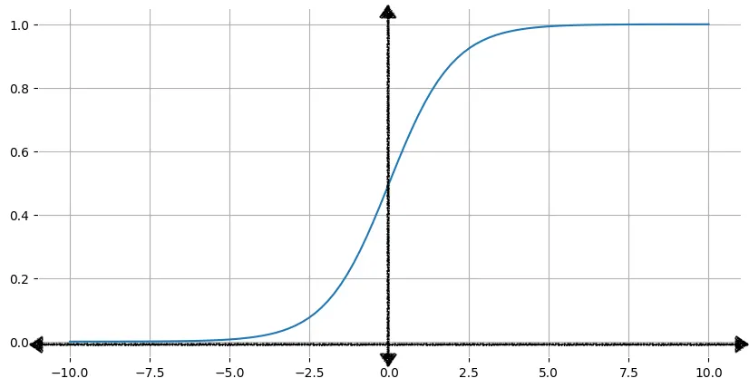

# Binary Classification

## Table of Contents

- [What Is Binary Classification?](#what-is-binary-classification)
- [How Does It Work? (From First Principles)](#how-does-it-work-from-first-principles)
  - [Where Is It Used Today?](#where-is-it-used-today)
- [Real-World Problem: Why The Old Loss Function Fails](#real-world-problem-why-the-old-loss-function-fails)
  - [The Placement Prediction Scenario](#the-placement-prediction-scenario)
  - [The Sigmoid Saturation Problem](#the-sigmoid-saturation-problem)
  - [Why Linear Updates Don't Work Here](#why-linear-updates-dont-work-here)
- [In-Depth Analysis Of Binary Classification](#in-depth-analysis-of-binary-classification)
  - [1. The Mathematical Engine (W · X + B)](#1-the-mathematical-engine-w--x--b)
  - [2. The Gatekeeper: Sigmoid Activation](#2-the-gatekeeper-sigmoid-activation)
  - [3. The Heart: Binary Cross-Entropy (Loss Function)](#3-the-heart-binary-cross-entropy-loss-function)
  - [4. The Trap: Evaluation Metrics](#4-the-trap-evaluation-metrics)
  - [5. Decision Thresholding](#5-decision-thresholding)
  - [Binary vs Multi-Class (Quick Note)](#binary-vs-multi-class-quick-note)

---

## What Is Binary Classification?

In simple terms: when we have only two choices (0 or 1, Yes or No, Cat or Dog) and we need to look at an input and determine which category it falls into — that is called **Binary Classification**.

> Its output is always **Discrete** (i.e., fixed values).

---

## How Does It Work? (From First Principles)

Imagine you have a point $(X)$. You feed it into the network:

1. **Linear Transformation:** $Z = W \cdot X + B$ (This generates a score).
2. **Activation (Sigmoid):** This score is converted into a probability between $0$ and $1$.
   $$\sigma(z) = \frac{1}{1 + e^{-z}}$$
3. **Threshold:** If the probability is greater than $0.5$, it is classified as "Class 1"; otherwise, it is "Class 0".

### Where Is It Used Today?

- **Email:** Spam vs Not Spam.
- **Medical:** Cancer vs No Cancer (detecting from images).
- **FinTech:** Fraud Transaction vs Real Transaction.
- **GenAI (In a way):** When you ask an AI "Is this code correct?", behind the scenes, the model is essentially performing a classification at some level.

---

## Real-World Problem: Why The Old Loss Function Fails

### The Placement Prediction Scenario

Consider that we need to predict whether a person will get placed or not. This depends on multiple factors such as DSA, Attendance, Projects, Aptitude, etc. And each of these factors has a certain weightage — for example, DSA has 40% weightage, Attendance has 20%, Projects has 20%, and Aptitude has 20%. So when we compute the answer in general, we get a number/percentage. Then we decide on a value ourselves, which we call the **threshold** — for example, if the score is above 50%, the person will get placed; otherwise, they won't.

And in this process as well, we use an activation function that gives us a value between 0 and 1. Just like we used ReLU earlier, here we use **Sigmoid**. So in this case too, we need to find the **Loss Function**. And this is where the catch lies.



### The Sigmoid Saturation Problem

If we look at the graph of **Sigmoid**, on both the negative and positive sides, there is a saturation point beyond which changes in the output are only in the range of 0.99999... (extremely small differences).

Now, if we use the old **Loss Function** here, there is a problem. Suppose the input is 10 Lakh (1,000,000) and the output is 0.9995..., and another input is 1000 with an output of 0.99914.... And if the actual output is 1.

If we use the old **Loss Function** for these:

```eq
Loss Function = Actual - Predicted

Loss Function1 = 1 - 0.9995 = 0.0005

Loss Function2 = 1 - 0.99914 = 0.00086
```

If we observe, the error for both cases is approximately the same.

### Why Linear Updates Don't Work Here

Similarly, suppose we have some inputs and their errors:

```Ex
Input1 = 10Lakh, Output1 = 0.8
Input2 = 10000, Output2 = 0.3

Actual Output = 1
```

If we look closely, in both cases, Input2 is much smaller than Input1, and Input1 is quite close to the actual output. So there is a major difference between Input1 and Input2. But following the ReLU logic, both would grow at a linear speed. If we calculate the new values:

```
Input1New = Input1Old + 0.01 * 0.8 * 10Lakh

Input2New = Input2Old + 0.01 * 0.3 * 10000
```

But if we look carefully here, Input2 is much farther from the actual output and is also much smaller — so it should be punished more heavily. This is exactly why in the **Sigmoid Function**, we calculate the **Loss Function** differently.

---

## In-Depth Analysis Of Binary Classification

Binary Classification started with a simple "Yes/No" logic, but today we combine thousands of complex linear lines ($W \cdot X + B$) through composition and add non-linearity to apply it to any complex problem.

So if we're talking "in-depth," Binary Classification is not just a game of 0 and 1. It is actually a game of **Probability Estimation** and **Decision Boundaries**.

From a developer's perspective, it has **4 pillars**: **Model Architecture, Activation, Loss Function,** and **Evaluation Metrics.**

---

### 1. The Mathematical Engine (W · X + B)

As we discussed, the first step is always to generate a score:
$$z = \sum (w_i \cdot x_i) + b$$
This $z$ can be any real number (from $-\infty$ to $+\infty$). But for classification, we need to "squash" it between $0$ and $1$.

### 2. The Gatekeeper: Sigmoid Activation

In binary classification, we always use the **Sigmoid Function**:
$$\sigma(z) = \frac{1}{1 + e^{-z}}$$

**Deep Logic:** The output of Sigmoid tells us: "What is the probability that this input belongs to Class 1?"

- If $\sigma(z) = 0.8$, it means there is an 80% chance that it is "Spam."
- If $\sigma(z) = 0.2$, it means there is only a 20% chance (i.e., there is an 80% chance that it is "Not Spam").

---

### 3. The Heart: Binary Cross-Entropy (Loss Function)

This is the most important part. How does the model learn? It uses "Log Loss" or **Binary Cross-Entropy (BCE)**.

Just being "wrong" isn't enough — how much to "punish" the model is what BCE decides.
$$L = -[y \log(\hat{y}) + (1-y) \log(1-\hat{y})]$$

- **Why do we use this?** If the model is very confident but wrong (e.g., predicted 0.99 for actual 0), then the $\log$ function pushes the loss towards "infinity." This gives the model a very strong "jolt" (high gradient), and it corrects itself quickly.

---

### 4. The Trap: Evaluation Metrics

This is where a lot of people make mistakes. Looking at just **Accuracy** alone is not sufficient.

Consider that you have 100 emails, out of which 99 are normal and only 1 is spam. If our model blindly classifies everything as "Normal," the accuracy would still be **99%**! But is the model actually good? **No.**

This is why we use the **Confusion Matrix**:

|                 | Predicted: NO           | Predicted: YES          |
| :-------------- | :---------------------- | :---------------------- |
| **Actual: NO**  | True Negative (TN)      | **False Positive (FP)** |
| **Actual: YES** | **False Negative (FN)** | True Positive (TP)      |

- **Precision:** When the model says "Yes," how many times is it actually correct? (Important for Spam Filters).
- **Recall:** Out of all the actual "Yes" cases, how many did the model catch? (Critical for Cancer Detection).
- **F1-Score:** The balance between Precision and Recall.

---

### 5. Decision Thresholding

The default threshold is $0.5$. But in the real world, we change it:

- **Medical App:** We want the test to show "Positive" even if there's just a 10% chance (Lower Threshold). Because a disease must not be missed (**High Recall**).
- **Court Case:** We want the system to not declare someone guilty until it's 99% sure (Higher Threshold). Because an innocent person must not be punished (**High Precision**).

---

### Binary vs Multi-Class (Quick Note)

- **Binary:** There is a single output neuron that gives a probability between 0 and 1. (Sigmoid + Binary Cross Entropy).
- **Multi-Class (e.g., Cat vs Dog vs Cow):** There is a separate neuron for each class. (Softmax + Categorical Cross Entropy).

**Practical Thinking:**
Imagine you are building a "Cheat Detection System" for **AlgoSurge Leetcode like clone**. If a student copies code and submits it, you need to classify them as "Caught" (1) or "Clean" (0). In this scenario, what would be more dangerous for you: a **False Positive** (calling an honest student a cheater) or a **False Negative** (letting a cheater go)? Based on this, what should your threshold be?

---
