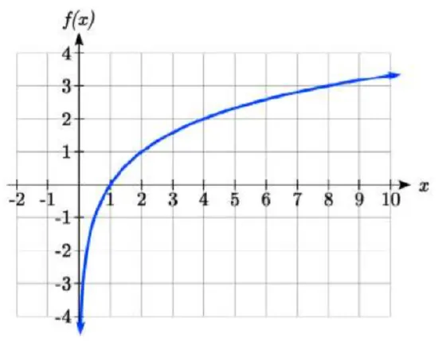

# Binary Classification vs Multi-Class Classification

## Table of Contents

- [Why Can't We Calculate The Loss Function The Same Way As ReLU?](#why-cant-we-calculate-the-loss-function-the-same-way-as-relu)
  - [Step 1: Computing The Raw Output](#step-1-computing-the-raw-output)
  - [Step 2: Why ReLU's Linear Punishment Worked](#step-2-why-relus-linear-punishment-worked)
  - [Step 3: Why Linear Punishment Fails With Sigmoid](#step-3-why-linear-punishment-fails-with-sigmoid)
  - [Step 4: Why We Use Logarithm In The Loss Function](#step-4-why-we-use-logarithm-in-the-loss-function)
  - [Step 5: The Loss Function When Actual Output Is 1](#step-5-the-loss-function-when-actual-output-is-1)
- [Problem 2: What Happens When The Actual Output Is 0?](#problem-2-what-happens-when-the-actual-output-is-0)
  - [Why Direct Log Fails Here](#why-direct-log-fails-here)
  - [The Fix: Using log(1-P)](#the-fix-using-log1-p)
  - [Summary Of Both Cases](#summary-of-both-cases)
- [What Is The Original Loss Function Formula For Sigmoid?](#what-is-the-original-loss-function-formula-for-sigmoid)

---

## Why Can't We Calculate The Loss Function The Same Way As ReLU?

### Step 1: Computing The Raw Output

Suppose we are building a placement prediction model. It has 4 features — DSA, Attendance, Projects, and Aptitude. And each feature has a certain weightage — for example, DSA has 40% weightage, Attendance has 20%, Projects has 20%, and Aptitude has 20%. So first, we compute the **Raw Output** the same way we did with **ReLU** using `Y = m*X + C`, and then we apply the **Activation Function** on top of it.

Suppose the general output equation for the placement model is:

```eq
Output = W1*X + W2*Y + W3*Z + W4*A + B
```

### Step 2: Why ReLU's Linear Punishment Worked

And if this general equation gives an answer of 120, then in **ReLU** we simply checked: if the output is greater than 0, we kept the general output as is; if it was less, we set it to 0. The ReLU equation for this:

```eq
ReLU(X) = max(0, X-Threshold)
```

In **ReLU**, when we calculated the loss function, the original input had a direct contribution, which meant the loss was calculated linearly, and the punishment was also linear.

### Step 3: Why Linear Punishment Fails With Sigmoid

But in the **Sigmoid Function**, we cannot do this, because in the sigmoid function we need the answer to be between 0 and 1. So when we pass the General Output through the sigmoid function, it gets compressed and gives an answer only between 0 and 1.

**Sigmoid Function:** $$\sigma(x) = \frac{1}{1 + e^{-x}}$$

So if we calculate the **loss function** here, the original input does not have a direct contribution anymore. Instead, its compressed value obtained from the **Sigmoid Function** is what contributes. And if we calculated the **Loss Function** the same way as ReLU, it would only punish linearly — even when there is a huge difference in the inputs, the punishment would still remain linear.

And if we look at the graph of **Sigmoid**, it is an exponential curve. So we need to calculate the loss function accordingly — meaning the output we got from **Sigmoid**, on which we will calculate the **Loss Function**, should be punished exponentially. And this is exactly why we use **Log** in the Loss Function.

> **In short:** In **ReLU**, we can calculate a normal **Loss Function** because the original input has a direct contribution. But in **Sigmoid**, we cannot calculate a normal **Loss Function** because the original input does not have a direct contribution — instead, its compressed value obtained from the **Sigmoid Function** is what contributes. So if we calculate a normal Loss Function on that value (which lies between 0 and 1), it will give very little punishment, and because of this, it would take far too many epochs to reach the actual output. That's why we use **Log** in the Loss Function.

Because Log treats the sigmoid's compressed output as if it were the raw output, and calculates the loss function accordingly. As a result, it punishes exponentially.

### Step 4: Why We Use Logarithm In The Loss Function

The reason we use Log is that **Sigmoid's** outputs lie between 0 and 1. Suppose Output1 = 0.6, Output2 = 0.1, and the Actual Output = 1. In this case, we need to push Output2 more aggressively towards 1, and push Output1 less aggressively towards 1. In other words, whoever is closer to 1 needs less of a push, and whoever is closer to 0 needs a bigger push. This kind of graph is only available in **Log**.



### Step 5: The Loss Function When Actual Output Is 1

So if the actual output is 1, the **Loss Function** becomes:

```eq
Loss Function/Error = - log(P), here P is the value of sigmoid function
```

The reason we subtract here (negate) is that if we look at the Log graph, all values below 1 are negative — meaning all values from 0 to 1 are negative. But if we want to use this to push the model, we need the **Loss Function** to be positive. So we negate the Log's negative value to make it positive.

---

## Problem 2: What Happens When The Actual Output Is 0?

Now suppose the predicted outputs from Sigmoid are: A=0.2, B=0.4, C=0.8, D=0.9, and the Actual Output is 0. In this situation, we need to push D the most towards 0, then C (less than D), then B (less than C), and A the least.

### Why Direct Log Fails Here

But if we calculate the log of all these values, we get approximately:

```
Log(A) => Log(0.2) => -1.609

Log(B) => Log(0.4) => -0.916

Log(C) => Log(0.8) => -0.223

Log(D) => Log(0.9) => -0.105
```

If we observe, the highest push is going to A — meaning it's completely reversed! To solve this problem, we use the formula `log(1-P)`.

### The Fix: Using log(1-P)

After applying this fix, our Loss Function becomes:

```eq
Log(A) => Log(1-0.2) => Log(0.8) => -0.223

Log(B) => Log(1-0.4) => Log(0.6) => -0.510

Log(C) => Log(1-0.8) => Log(0.2) => -1.609

Log(D) => Log(1-0.9) => Log(0.1) => -2.302
```

So now this correctly pushes D the most towards 0, then C (less), then B (even less), and A the least towards 0. This is why we slightly changed the formula here.

### Summary Of Both Cases

```eq
// When Actual Output = 1,
Loss Function = -log(P)

// When Actual Output = 0,
Loss Function = log(1-P)
```

---

## What Is The Original Loss Function Formula For Sigmoid?

```formula
Loss Function/Error = -(Y*log(P) - (1-Y)*log(1-P))

// Here Y means Actual Output
// P means Predicted Output, which is obtained from the sigmoid function
```

This **Loss Function** is also known as **Binary Cross Entropy**.

And the formula for updating weights is:

```eq
New Weight = Old Weight - Learning Rate * Error * Input
```

---
